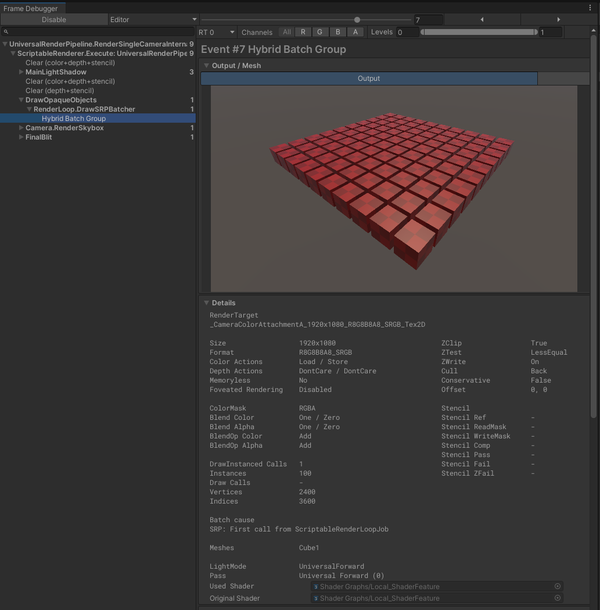
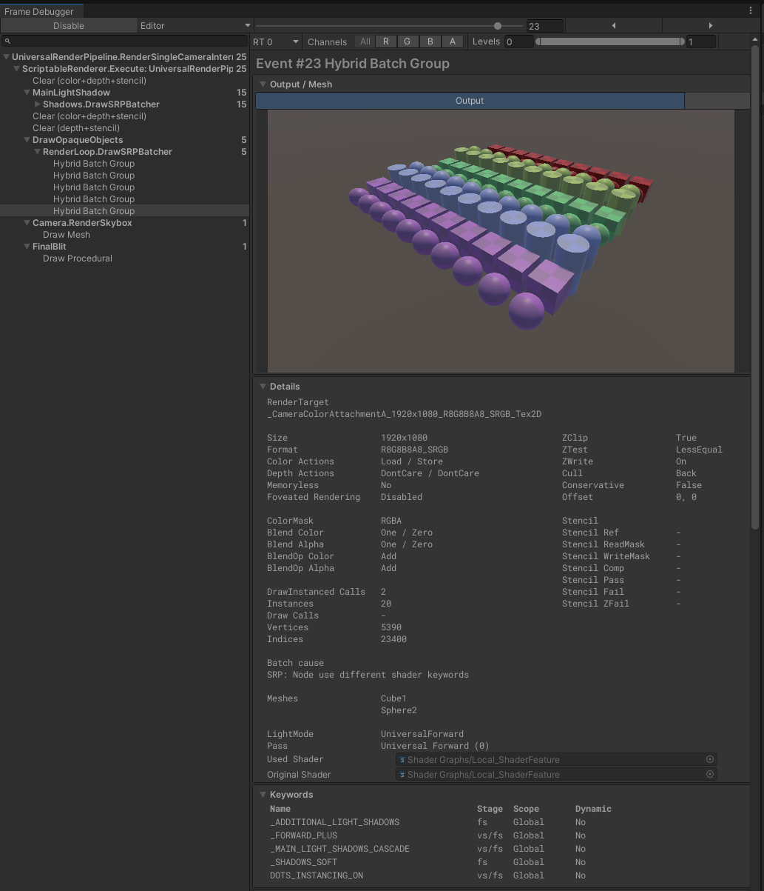
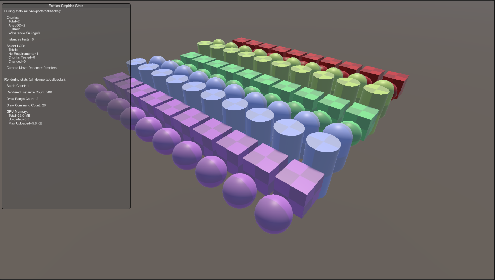

# Entities Graphics Performance

This page describes how to measure Entities Graphics rendering performance in your project.

Entities Graphics bakes authoring GameObjects into Entities and creates BatchRendererGroup batches which generates a list of draw commands for rendering. Each draw command renders a group of instances that have the same Mesh and Material. BatchRendererGroup makes draw call setup lightweight and efficient with a special fast path of the SRP Batcher, and uses a new shader instancing mode called DOTS Instancing to render large instance counts efficiently.

For more information about the BatchRendererGroup, see [BatchRendererGroup](xref:batch-renderer-group).

For more information about the DOTS instancing, see [DOTS Instancing shaders](xref:dots-instancing-shaders).

The rule of optimizing the rendering with DOTS instancing in entities is very similar to SRP Batcher in GameObjects. By dividing instances per DrawInstanced Calls you could get a rough estimation of the batch efficiency. The higher the number of instances per DrawInstanced Calls, the better the performance.

## Using FrameDebugger

If objects are rendered with DOTS instancing, the draw events of these objects will appear as Hybrid Batch Group on the FrameDebugger, with a shader keyword called DOTS_INSTANCING_ON.

**For example for a scene having 100 cubes with same material in subscene:**

1. Open and Enable FrameDebugger
2. Navigate to an opaque object draw call
3. Select the Hybrid Batch Group
4. On the right, under the Keywords section, there lists DOTS_INSTANCING_ON
5. On the Output section above the Keywords section
	* DrawInstanced Calls = 1
    * Instances = 100

    In this case, since all the cubes are using the same mesh and material, therefore all of the 100 cubes are batched into 1 DrawInstanced Calls, which means the rendering is at the highest batching efficiency

**For a scene having 100 objects in subscene with 5 different materials (different shader variant) and 10 different meshes:**

1. There are 5 Hybrid Batch Groups as different shader variant breaks the batching
2. On each of the Hybrid Batch Groups
	* DrawInstanced Calls = 2
	* Instances = 20

    For this Hybrid Batch Group, it draws 20 objects with 2 DrawInstanced Calls, and each DrawInstanced Calls represents a mesh. That means, batching efficiency is 10 instances per 1 DrawInstanced Call, which is much lower than the above example with all objects having the same mesh and material.

## Using EntitiesGraphicsStatsDrawer

Entities Graphics provides an on-screen GUI showing Culling and Rendering stats. To use EntitiesGraphicsStatsDrawer, create a new GameObject and attach the EntitiesGraphicsStatsDrawer component. Enter playmode, and find the overlay GUI on GameView.

**Using the same scene which have 100 objects in subscene with 5 different materials (different shader variant) and 10 different meshes:**

The rough batching efficiency can also be observed by checking Renderered Instance Count per Draw Command:
* Renderered Instance Count = 200
* Draw Command Count = 20

Rendered Instance Count is 200 instead of 100 because there are 2 draw events which each draws 100 objects: one is MainLightShadow and one is DrawOpaqueObjects. The same for Draw Command Count, it is 20 instead of 10 because 10 Draw Commands for MainLightShadow and 10 for DrawOpaqueObjects. In this case, on average there are 10 instances rendered per 1 Draw Command.

> [!NOTE]
> EntitiesGraphicsStatsDrawer is Editor only.

## Using Profiler

To measure actual performance of rendering, besides measuring CPU and GPU frame timing, there are some profiler markers that are useful for measuring more detailed timings.

* Profiler Markers that are used in both BatchRendererGroup and SRP batcher:
	* SRPBRender.ApplyShader
	* SRPBShadow.ApplyShader
	* RenderLoop.DrawSRPBatcher
	* Shadows.DrawSRPBatcher
	* DrawBuffersBatchMode (on RenderThread)
* Profiler Markers that are specific to BatchRendererGroup:
	* BatchRendererGroup.CreateMissingMetadata
	* BatchRendererGroup.UpdateMetadataCache
	* BatchRendererGroup.GetCacheDeltaWritable
	* BatchRendererGroup.InvalidateMetadata
	* BatchRendererGroup.InvalidateStaleBatches
	* BatchRendererGroup.IncorporateCacheDelta

**Known performance issues:**

* There is overhead for Entities Graphics to create the batches, therefore in cases where not many objects are batched, rendering entities with Entities Graphics might be slower on some platforms, especially Android, than rendering GameObject with SRP batcher.
* Performance might be affected on Android hardware or drivers which does not favor persistent GPU data approach in BatchRendererGroup.
* On Android, GPU performance is expected to be slightly slower in rendering entities compared to rendering GameObjects.
* On Android, performance might be affected due to the cost on shaders with DOTS instancing properties even though property is not used.
* OpenGL is supported but performance gain is not guaranteed.