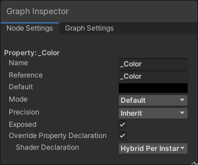

uid: material-overrides-howto

# Material overrides using the Material Override Asset

In Entities Graphics, you can override material properties without writing any code. This document describes the process on how to setup Material overrides for a material without writing any code. For more information on Material overrides, see [Material overrides](material-overrides.md).

The Material Override Asset is experimental. 

## Setting up Material overrides

This section explains how to set up overrides for a material.

1. Select the material you want to override. If one does not exists, create a new one (menu: **Assets > Create > Material**) and select it. 
2. If the material uses a Shader Graph, enable **Override Property Declaration** then set **Shader Declaration** to **Hybrid Per Instance** for every custom property you want to override. 
3. Create a new Material Override Asset (menu: **Assets > Create > Shader > Material Override Asset**) and select it.
4. In the Inspector, add your material to the **Material** property. 
5. Click **Add Property Override** and select the properties you want this asset to override. Note that, if the material uses custom properties from a Shader Graph, you may have to wait for an asset data refresh and import to happen after you select the properties. When you add the property overrides, Unity creates a C# script next to your material in the Project window. Do not touch this file. 
6. After you add the property overrides, modify them to be the values you want.
7. Select a GameObject that uses the material (or assign the material to a GameObject in your scene). Then, in the Inspector, click **Add Component** and select **Material Override**.
8. In the Inspector for that component, add your new Material Override Asset to the **Override Asset** field. 
9. You can add this asset to all GameObjects you want to give this set of overrides. Editing the material properties from the Inspector while the Material Override Asset is selected updates all the corresponding GameObjects.
10. You can also edit the properties on a GameObject's **Material Override** component as well to only affect that instance. When you do this, the margin turns blue and the property text becomes bold. This means you have overridden the defaults of the Material Override Asset.
11. You can either push the instance's setting to the asset to update all other GameObjects or reset it to the asset's default by right clicking on the property. This does not affect GameObjects that also override the asset's default values. 
12. You can create more Material Override Assets for the same material with the same or a different set of properties and then modify those properties per-GameObject as well. It does not interfere with other Material Override Assets.

